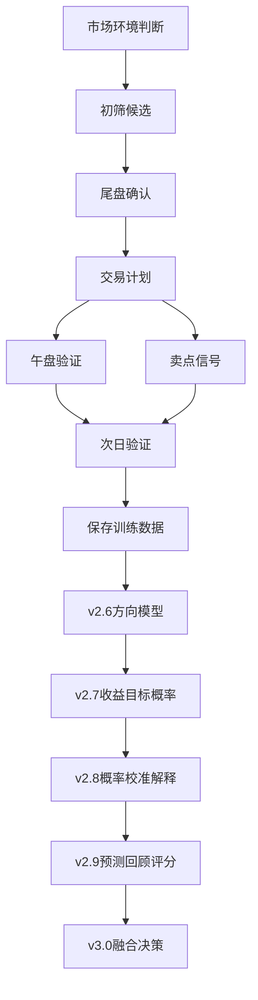

# 项目地图

## 需求文档

- [[02-日常操作工作流]]：页面按钮、Tab 和真实交易日使用顺序说明。
- [[00-需求基线]]：当前仓库已实现能力、核心规则、输出文件和已知问题。
- [[02-路线需求文档]]：v2.4-v3.0 成熟决策系统路线需求。
- [[01-当前功能与成熟系统对比]]：当前规则系统和目标概率决策系统的差距。
- [[03-v2.5训练数据集与标签系统]]：训练样本、标签口径、真实交易记录、LLM 辅助标注和 API 价格对比。
- [[04-v2.5工作流与数据质量优化]]：页面工作流简化、真实交易记录复盘、数据质量优化。
- [[05-v2.6次日涨跌方向模型]]：固定持仓样本池、LightGBM 方向模型、评估报告和概率输出。
- [[06-v2.7收益目标概率模型]]：达到 +1%、达到 +2%、止损概率和收益风险比。
- [[07-v2.8概率校准与模型解释]]：校准概率、Brier Score、单票多空因素。
- [[08-v2.9预测回顾与模型评分]]：预测回顾、模型评分卡、分市场和分行业表现。
- [[09-v3.0封板差距分析与五步计划]]：当前系统与目标系统差距、五个 commit 封板计划。

## 开发计划

- [[00-开发计划路线图]]：v2.4-v3.0 的阶段拆解、验收标准和风险。
- [[01-v3.0封板五步开发计划]]：v3.0 封板前五个 commit 的执行顺序和验收主线。

## 建议继续沉淀的内容

- 运行日报：记录每次主流程运行时间、数据源、失败股票、生成结果。
- 交易复盘：记录计划、买点、卖点、实际盈亏、偏离原因。
- 因子笔记：记录哪些因子有效、哪些因子需要降权或移除。
- 需求变更：记录从飞书或实际使用中新增的需求，并标注版本归属。
- 模型实验：记录特征版本、标签口径、训练区间、验证结果和模型评分。

## 项目主流程

