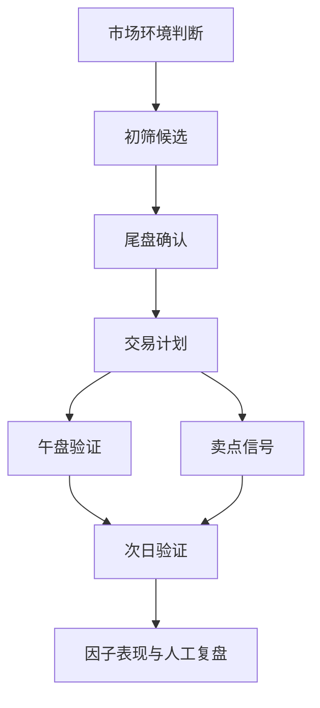

# 项目地图

## 需求文档

- [[需求基线-v1.0]]：当前仓库已实现能力、核心规则、输出文件和已知问题。
- [[需求文档-v1.1]]：下一版本功能需求、非功能需求、完成定义。

## 开发计划

- [[开发计划-v1.1]]：v1.1 的阶段拆解、验收标准、风险和发布建议。

## 建议继续沉淀的内容

- 运行日报：记录每次主流程运行时间、数据源、失败股票、生成结果。
- 交易复盘：记录计划、买点、卖点、实际盈亏、偏离原因。
- 因子笔记：记录哪些因子有效、哪些因子需要降权或移除。
- 需求变更：记录从飞书或实际使用中新增的需求，并标注版本归属。

## 项目主流程

