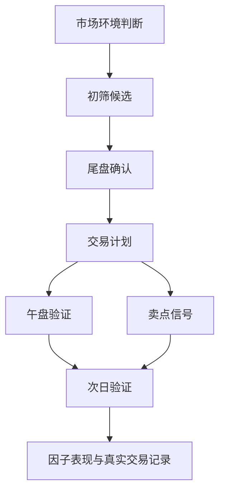

# 项目地图

## 需求文档

- [[日常操作工作流-v2.5]]：页面按钮、Tab 和真实交易日使用顺序说明。
- [[需求基线-v1.0]]：当前仓库已实现能力、核心规则、输出文件和已知问题。
- [[需求文档-v1.1]]：v2.4-v3.0 成熟决策系统路线需求。
- [[当前功能与成熟决策系统对比]]：当前规则系统和目标概率决策系统的差距。
- [[v2.5训练数据集与标签系统需求文档]]：训练样本、标签口径、真实交易记录、LLM 辅助标注和 API 价格对比。
- [[v2.5.1-v2.5.2工作流简化与数据质量优化需求文档]]：页面工作流简化、真实交易记录复盘、数据质量优化。

## 开发计划

- [[开发计划-v1.1]]：v2.4-v3.0 的阶段拆解、验收标准和风险。

## 建议继续沉淀的内容

- 运行日报：记录每次主流程运行时间、数据源、失败股票、生成结果。
- 交易复盘：记录计划、买点、卖点、实际盈亏、偏离原因。
- 因子笔记：记录哪些因子有效、哪些因子需要降权或移除。
- 需求变更：记录从飞书或实际使用中新增的需求，并标注版本归属。
- 模型实验：记录特征版本、标签口径、训练区间、验证结果和模型评分。

## 项目主流程

