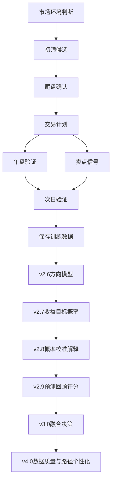

# 项目地图

<!-- 知识图谱关系:start -->

> [!note] 知识图谱关系
> 所属阶段：入口
> 上游：[[00-知识库首页]]
> 下游：[[00-系统需求基线]]、[[00-总体开发路线图]]、[[05-知识图谱关系索引]]

<!-- 知识图谱关系:end -->
## 需求文档

- [[02-日常操作流程]]：页面按钮、Tab 和真实交易日使用顺序说明。
- [[03-模型训练预测流程]]：模型训练、模型预测和最终操作之间的真实使用关系。
- [[04-系统操作说明书]]：实盘时先看最终操作、固定持仓和候选池短话术。
- [[05-知识图谱关系索引]]：解释文件命名、双链关系和图谱查看方式。
- [[00-系统需求基线]]：当前仓库已实现能力、核心规则、输出文件和已知问题。
- [[02-产品路线需求]]：v2.4-v3.0 成熟决策系统路线需求。
- [[01-功能差距对比]]：当前规则系统和目标概率决策系统的差距。
- [[03-训练数据集与标签系统需求]]：训练样本、标签口径、真实交易记录、LLM 辅助标注和 API 价格对比。
- [[04-工作流与数据质量优化需求]]：页面工作流简化、真实交易记录复盘、数据质量优化。
- [[05-次日涨跌方向模型需求]]：固定持仓样本池、LightGBM 方向模型、评估报告和概率输出。
- [[06-收益目标概率模型需求]]：达到 +1%、达到 +2%、止损概率和收益风险比。
- [[07-概率校准与模型解释需求]]：校准概率、Brier Score、单票多空因素。
- [[08-预测回顾与模型评分需求]]：预测回顾、模型评分卡、分市场和分行业表现。
- [[09-封板差距分析与五步计划]]：当前系统与目标系统差距、五个 commit 封板计划。
- [[10-模型页面简化需求]]：模型页面去版本噪音、概率一致提示和简化验收。
- [[11-实盘页面简化需求]]：交易记录、明日计划、固定持仓、候选池和系统次日验证的页面简化需求。

## 开发计划

- [[00-总体开发路线图]]：v2.4-v3.0 的阶段拆解、验收标准和风险。
- [[01-封板五步开发计划]]：v3.0 封板前五个 commit 的执行顺序和验收主线。
- [[02-封板验收清单]]：v3.0 封板后逐条验收命令、页面和输出文件。
- [[03-项目验收报告]]：v3.0 最后运行效果、达标能力、示范系统差距和封板判断。
- [[04-五阶段宏观开发计划]]：v4.0 五个子版本的宏观构思。

## 建议继续沉淀的内容

- [[01-实盘操作问题记录]]：盘中先记问题，晚上再统一转成需求和开发任务。
- [[02-系统复盘与优化方案-2026-07-22]]：今日“待优化”拆解、模型报告结论和页面修改方案。
- 运行日报：记录每次主流程运行时间、数据源、失败股票、生成结果。
- 交易复盘：记录计划、买点、卖点、实际盈亏、偏离原因。
- 因子笔记：记录哪些因子有效、哪些因子需要降权或移除。
- 需求变更：记录从飞书或实际使用中新增的需求，并标注版本归属。
- 模型实验：记录特征版本、标签口径、训练区间、验证结果和模型评分。

## 项目主流程

