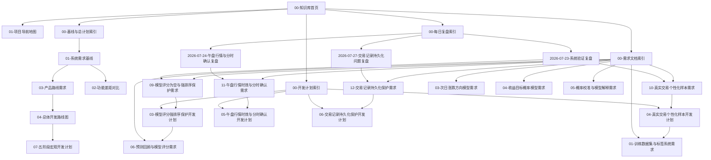

# 知识图谱关系索引

<!-- 知识图谱关系:start -->

> [!note] 知识图谱关系
> 所属阶段：图谱索引
> 上游：[[00-知识库首页]]、[[01-项目导航地图]]
> 下游：[[00-基线与总计划索引]]、[[00-每日复盘索引]]、[[00-需求文档索引]]、[[00-开发计划索引]]

<!-- 知识图谱关系:end -->

## 命名规则

Obsidian 图谱显示文件名，连线来自 “双向链接”。以后文件命名遵循：

- `01-基线与总计划`：长期基线和总路线。
- `02-每日复盘`：当天发现和盘后判断。
- `03-需求文档`：从复盘拆出的“要改什么”。
- `04-开发计划`：对应需求的“怎么改”。
- `05-交易复盘`：长期案例和交易经验。

编号只用于排序；真正的依赖关系写在文档顶部的“知识图谱关系”块和正文双链里。

## 主依赖关系

## 每天怎么找

- 想知道系统边界：看 [[00-基线与总计划索引]]。
- 想看今天发现的问题：看 [[00-每日复盘索引]]。
- 想看某个功能为什么要做：看 [[00-需求文档索引]]。
- 想看某个功能怎么开发：看 [[00-开发计划索引]]。
- 想看长期交易经验：看 [[00-交易复盘索引]]。

## 盘后复盘沉淀规则

每日盘后复盘不能直接变成开发流水。固定流程是：

1. `02-每日复盘`：记录问题和判断。
2. `03-需求文档`：把需要修改的功能单独起需求文档。
3. `04-开发计划`：把对应开发步骤和验收标准单独起计划文档。
4. 开发完成后，commit 说明要对应这两份文档。
