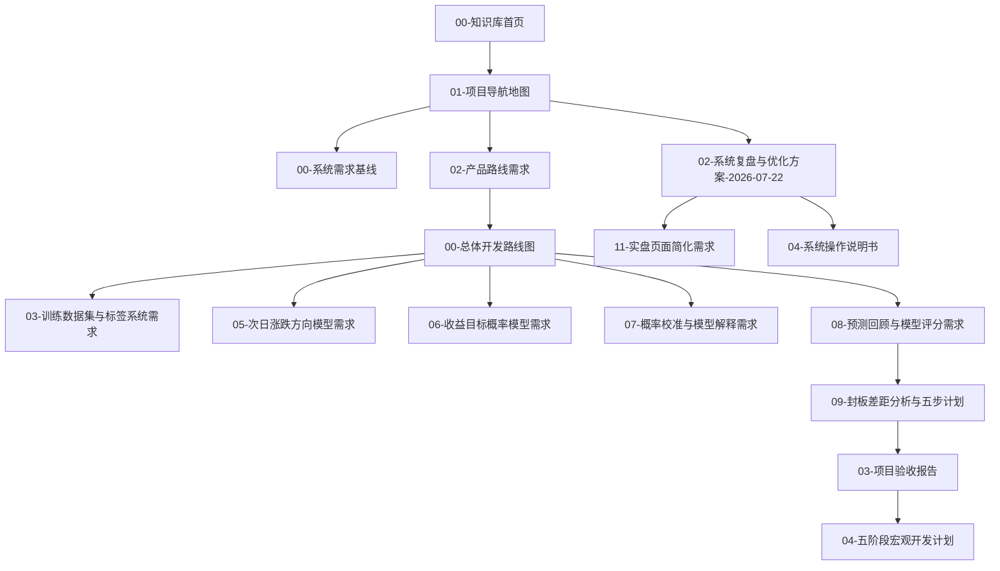

# 知识图谱关系索引

<!-- 知识图谱关系:start -->

> [!note] 知识图谱关系
> 所属阶段：图谱索引
> 上游：[[00-知识库首页]]、[[01-项目导航地图]]
> 下游：[[00-系统需求基线]]、[[00-总体开发路线图]]、[[02-系统复盘与优化方案-2026-07-22]]

<!-- 知识图谱关系:end -->
## 命名规则

Obsidian 图谱显示的是文件名，文件之间的连线来自 `[[双链]]`。因此文件名用中文说明“这篇文档是什么”，前面的数字只用于排序，不代表版本依赖。

当前知识库按五类组织：

- `00-系统入口`：每天先看的导航、流程和说明书。
- `10-产品需求`：功能为什么要做、做到什么程度算完成。
- `20-开发计划`：需求拆成哪些阶段和验收点。
- `30-运行记录`：每天运行、实盘问题和临时复盘。
- `40-交易复盘`：交易案例和长期经验沉淀。

## 主依赖关系

## 每天怎么找

- 想知道怎么用页面：看 [[04-系统操作说明书]]。
- 想知道当前功能边界：看 [[00-系统需求基线]]。
- 想看后续怎么开发：看 [[04-五阶段宏观开发计划]]。
- 想看今天发现了什么问题：看 [[02-系统复盘与优化方案-2026-07-22]]。
- 想把实盘问题先记下来：写到 [[01-实盘操作问题记录]]。

## 图谱怎么看

- `首页` 和 `项目地图` 是中心节点。
- `需求` 节点回答“做什么”。
- `开发计划` 节点回答“怎么做”。
- `运行记录` 节点回答“今天发生了什么”。
- `交易复盘` 节点回答“长期经验是什么”。
